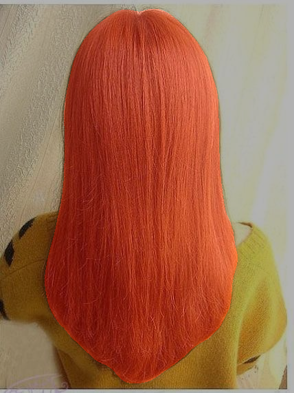

# hair segmentation

### 头发分割, 目前只有判断,训练还没有加载进来。

## usage

```
cd data
wget https://www.dropbox.com/s/35momrh68zuhkei/Figaro1k.zip
unzip Figaro1k.zip


cd checkpoints
wget https://github.com/YBIGTA/pytorch-hair-segmentation/blob/master/models/pspnet_resnet101_sgd_lr_0.002_epoch_100_test_iou_0.918.pth
```

到src目录下,进行判断

```
python validation.py
```

## 效果




## todo

1. 网络加速 (目前是CPU 0.67fps)
2. 部署到视频 (实时渲染)
3. 尝试各种网络


reference [pytorch-hair-segmentation](https://github.com/YBIGTA/pytorch-hair-segmentation/)
